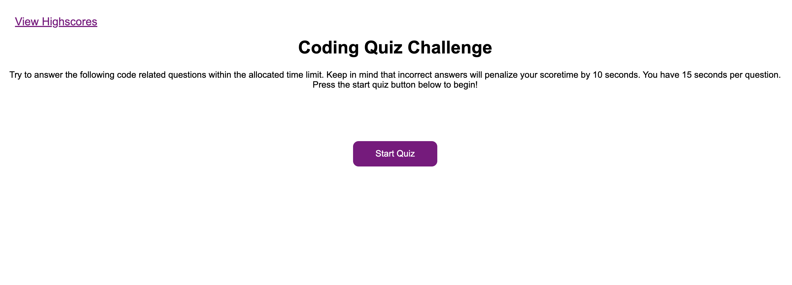
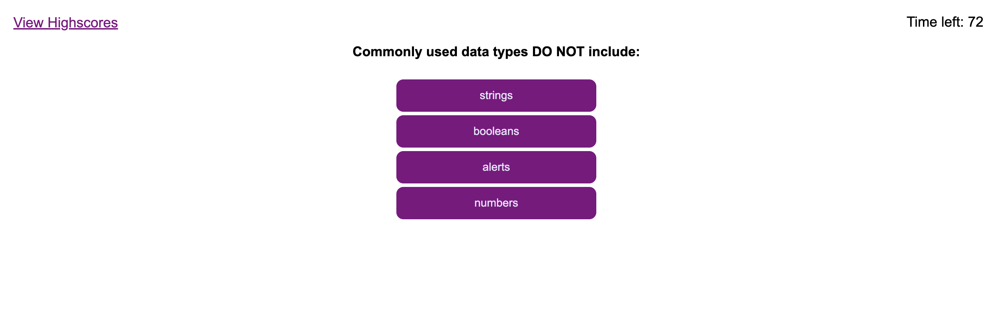
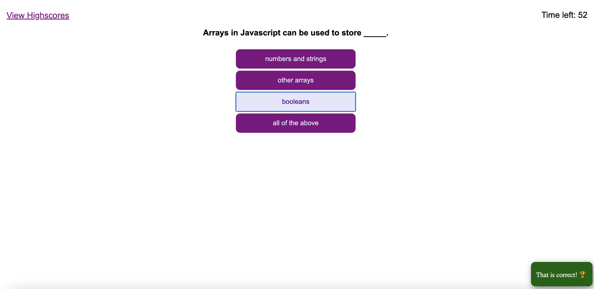
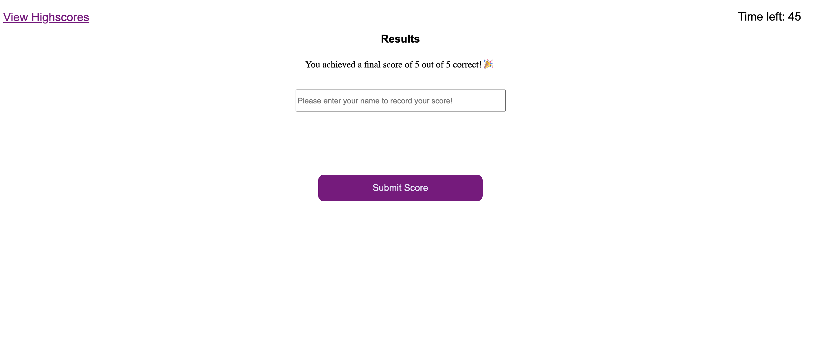
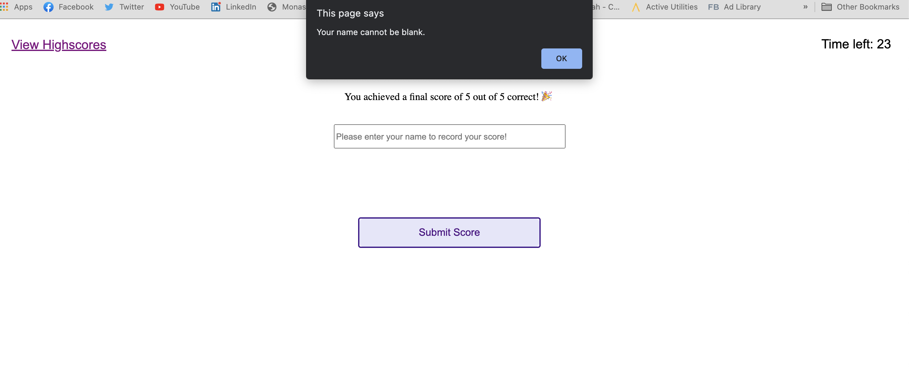

# Web APIs: Code Quiz
Project Owner - Aaron Au Yoong
 
View live link here: <https://aaronauyoong.github.io/js-codingquiz/.>

At some point in your journey to become a full-stack web developer, you’ll likely be asked to complete a coding assessment&mdash;perhaps as part of an interview process. A typical coding assessment includes both multiple-choice questions and interactive coding challenges. 

## Introduction
During our journey to becoming a full-stack web developer, there will come instances where we will be asked to partake in coding assessments. To prepare for this, a quiz application is needed to test fundamental Javascript knowledge. 

## Technologies
This quiz application was built using HTML, CSS and Javascript. This application primarily relies on Javascript to: 
 
1) Begin the quiz, 
 
2) Provide questions and multiple-choice answers, 
 
3) Collect user data to determine whether the answers are correct, 
 
4) Keep score and appends a final "highscore" page from quiz results. 
 

## Deliverables
A working quiz application to aid users in testing fundamental Javascript knowledge. 
- Start Quiz button initiates quiz timer and first quiz question
- Answering a question will display a popup indicating whether answer is correct or incorrect, and proceeds to the next question
- Selecting a correct answer will add points to a score (will be displayed at the end)
- Selecting an incorrect answer reduces time on countdown
- Once all questions are answered/time runs out, quiz will be over and the final score displayed 
- User will be able to to input their name to save their score to local storage
- List of highscores will be available at the final screen
- Options to clear highscores and replay quiz are available

## Installation
To install this application, please download the zip file, or alternatively clone the repository through GitHub's guidelines. 

## Screenshots

1. Starting page of quiz application:
 

 
 

2. When the quiz page loads, and first question appears:
 

 
 

3. A popup will appear at the bottom right of the screen, indicating whether user answered correctly or incorrectly:
 

 
 

4. Upon quiz completion/timer running out, will display final score and allow user to input name/initials to record score:
 

 
 

5. High score page will be displayed:
 
<!--  -->
 
 